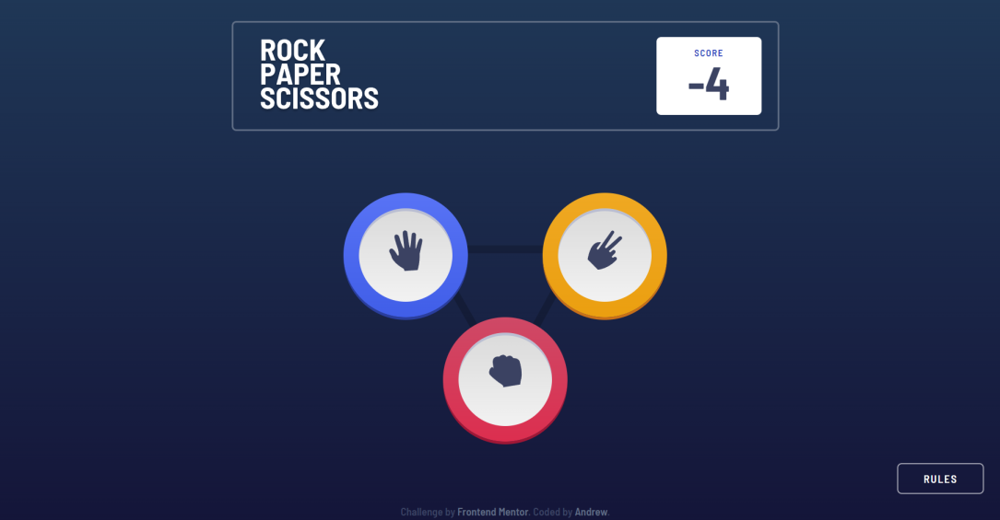

# Frontend Mentor - Rock, Paper, Scissors solution

This is a solution to the [Rock, Paper, Scissors challenge on Frontend Mentor](https://www.frontendmentor.io/challenges/rock-paper-scissors-game-pTgwgvgH). Frontend Mentor challenges help you improve your coding skills by building realistic projects.

## Table of contents

- [Frontend Mentor - Rock, Paper, Scissors solution](#frontend-mentor---rock-paper-scissors-solution)
  - [Table of contents](#table-of-contents)
  - [Overview](#overview)
    - [The challenge](#the-challenge)
    - [Screenshot](#screenshot)
    - [Links](#links)
  - [My process](#my-process)
    - [Built with](#built-with)
  - [Author](#author)

## Overview

### The challenge

Users should be able to:

- View the optimal layout for the game depending on their device's screen size
- Play Rock, Paper, Scissors against the computer
- Maintain the state of the score after refreshing the browser _(optional)_
- **Bonus**: Play Rock, Paper, Scissors, Lizard, Spock against the computer _(optional)_

### Screenshot

### Links

- Solution URL: [https://www.frontendmentor.io/challenges/rock-paper-scissors-game-pTgwgvgH/hub/rock-paper-scissors-game-vue3-tailwind-css-vite-BkowzhJvc](https://www.frontendmentor.io/challenges/rock-paper-scissors-game-pTgwgvgH/hub/rock-paper-scissors-game-vue3-tailwind-css-vite-BkowzhJvc)
- Live Site URL: [https://ap2soft.github.io/frontend-mentor-rps-game/](https://ap2soft.github.io/frontend-mentor-rps-game/)

## My process

### Built with

- [ViteJs](https://vitejs.dev/) - Next Generation Frontend Tooling
- [Tailwind CSS](https://tailwindcss.com) - A utility-first CSS framework
- [Vue3](https://vuejs.org/) - The Progressive JavaScript Framework
- Mobile-first workflow

## Author

- Website - [Andrew](https://ap2.dev)
- Twitter - [@andreich1980](https://www.twitter.com/andreich1980)
